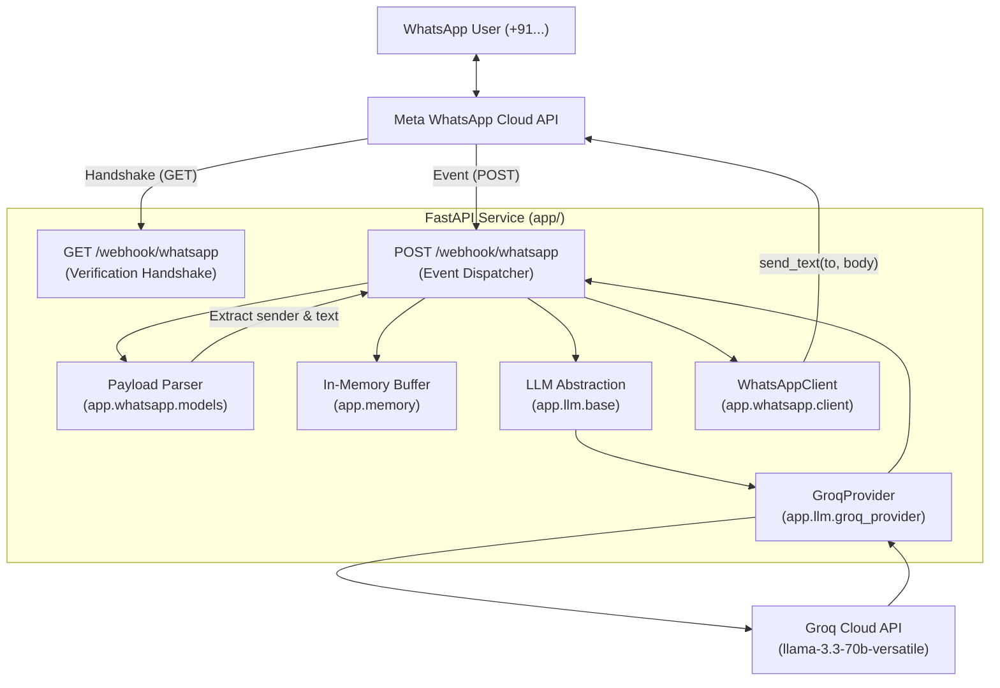

# Architecture Documentation: Demo #2 (Milestone 1)

## System Overview

Milestone 1 of the **AI WhatsApp Support + Lead Qualification Agent** implements a minimal, reliable, closed-loop messaging pipeline:

```
WhatsApp User / Test Number
         │ (User sends message)
         ▼
Meta WhatsApp Cloud API
         │ (Webhook POST event)
         ▼
FastAPI Backend (/webhook/whatsapp)
   ├── Webhook Verification (GET /webhook/whatsapp)
   ├── Safe Payload Parsing (extracts sender and message text)
   ├── In-Memory Conversation Memory (bounded per-sender deque)
   ├── LLM Abstraction Layer (GroqProvider)
   └── WhatsApp Client Module (HTTP POST to Meta Cloud API)
         │ (Reply payload)
         ▼
Meta WhatsApp Cloud API
         │ (Delivers message)
         ▼
WhatsApp User / Test Recipient
```

---

## Component Architecture



---

## Module Breakdown

### 1. Webhook Router (`app/main.py`)
- **GET `/webhook/whatsapp`**:
  - Implements the Meta verification handshake.
  - Validates `hub.mode == "subscribe"` and `hub.verify_token == WHATSAPP_VERIFY_TOKEN`.
  - Returns `hub.challenge` as plain text with HTTP 200 on success.
  - Returns HTTP 403 on mismatched token or missing parameters.
- **POST `/webhook/whatsapp`**:
  - Validates JSON structure. Returns HTTP 400 for malformed payloads.
  - Passes payload to `parse_incoming_webhook`.
  - Discards delivery statuses (sent/delivered/read) and non-text events safely with HTTP 200 to prevent Meta webhook retries.
  - For text messages, coordinates memory update, LLM reply generation, and WhatsApp API dispatch.

### 2. WhatsApp Integration (`app/whatsapp/`)
- **`models.py`**:
  - Defines `IncomingTextMessage` and `WebhookParseResult`.
  - Safely extracts sender phone number and message body without raising unexpected exceptions on malformed or empty payloads.
- **`client.py`**:
  - `WhatsAppClient.send_text(to, body)` sends messages via `POST https://graph.facebook.com/{api_version}/{phone_number_id}/messages`.
  - Wraps API and network errors into `WhatsAppClientError`.
  - Masks phone numbers in logs and never exposes authorization tokens.

### 3. LLM Abstraction (`app/llm/`)
- **`base.py`**:
  - Defines `ChatMessage` schema and runtime-checkable `LLMProvider` protocol.
  - Defines `get_agent_reply(messages, provider)` abstraction.
- **`groq_provider.py`**:
  - Concrete implementation using `groq.AsyncGroq`.
  - Injects system prompt and formats conversation history into Groq chat completion format.
  - Isolate provider-specific logic to allow easy addition of future providers.

### 4. Memory Layer (`app/memory.py`)
- **`InMemoryConversationMemory`**:
  - Stores recent messages in memory using Python `collections.deque(maxlen=N)`.
  - Keyed by sender phone number.
  - Preserves user and assistant turns without an external database.

### 5. Configuration (`app/config.py`)
- Loaded via `pydantic-settings` from environment variables and `.env`.
- Fails clearly if any required variable is missing when running in production.
- Sanitizes phone numbers (`mask_phone_number`) and tokens (`mask_secret`) for safe logging.

---

## Security & Privacy Safeguards

1. **Zero Secret Leakage**:
   - Access tokens, API keys, and verify tokens are read strictly from environment variables.
   - No secrets are stored in code, committed to git, or printed in logs or error messages.
2. **PII Protection**:
   - Phone numbers are masked in all logs (e.g. `********3210`).
3. **Webhook Protection**:
   - Webhook verification prevents unauthorized sources from pretending to be Meta.
   - Handshake returns HTTP 403 when tokens do not match.
4. **Git Protection**:
   - Local `.env` files are ignored by git in both parent and demo-specific `.gitignore`.
